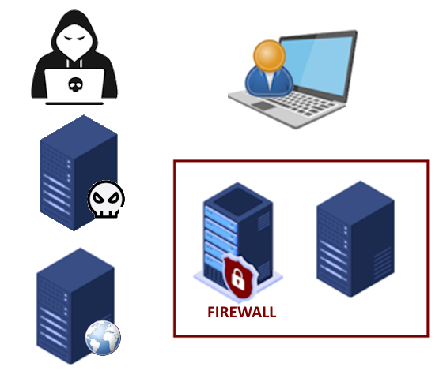

# Hospital Cybersecurity Tabletop Presentation

## Cybersecurity Breach Demonstration - System Roles

## Tabletop Servers

## 💻 Smallpox — Remote Command and Control (C2)
*Smallpox is our cloud-hosted attack infrastructure. It acts as the command and control server — receiving connections from compromised machines, issuing payloads, and coordinating the breach from outside the hospital network. It demonstrates how attackers can operate from anywhere in the world, maintain persistent access, and pivot through internal systems without ever physically touching the environment.*

---

## 🧪 Sepsis — Cloud-Based Attack Platform with Dedicated Domain
*Sepsis is a cloud-hosted, multi-role attack server operating under its own domain name. It simulates a real-world threat actor’s infrastructure, running three distinct services on separate ports: a spoofed Adobe update site for malware delivery, a credential capture system for phishing, and a man-in-the-middle proxy for email interception. This configuration shows how attackers can stage full-spectrum campaigns entirely from the cloud, using realistic domains and infrastructure to evade detection and gain trust.*

---

## 💻 Anthrax — Local Threat Actor Workstation
*Anthrax is the physical laptop used by the threat actor while operating from a public location — in this case, the fictional StarHacks Coffee House. It simulates an attacker connecting from an untrusted, external network (like public Wi-Fi), launching targeted attacks against hospital devices such as Ringworm. Anthrax represents the initial compromise vector, capturing how external access and poor user decisions can lead to internal breaches.*

---

## 💼 Ringworm — The Roninette’s Compromised Laptop
*Ringworm is the endpoint device assigned to the fictional employee, the Roninette. It’s the first system breached outside the hospital network, simulating what happens when a user connects to public Wi-Fi and opens a malicious file. Later in the demonstration, Ringworm is compromised again through a man-in-the-middle email attack, highlighting how layered exploitation can occur across different environments and attack vectors.*

---

## 🖥️ Chagas — Exposed Production Server
*Chagas is a production server assumed to be safely protected within the hospital’s internal network. However, due to a critical misconfiguration, it was unintentionally exposed to the guest network. This oversight allowed a pivoted attack from a previously compromised endpoint, demonstrating how even well-segmented infrastructure can be breached when boundary controls fail.*

